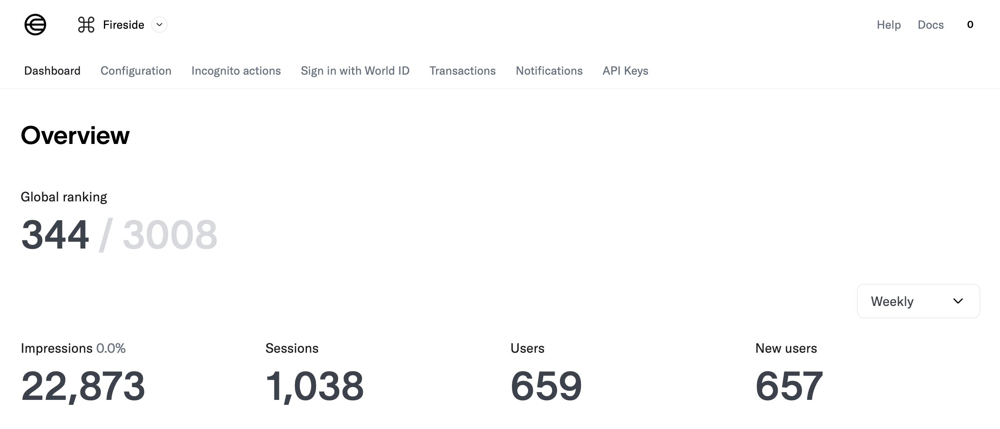

##### Current, 2025

###### September

Authentic is going well, almost ready for launch. The fall semester starts at NYU, and the back-to-school season is upon us. My schedule is packed since I plan on graduating early by December. 

Here's a fun little hack that I built for the Authentic Office in Korea: blink all the lights in the office on a PR merge to celebrate a new feature shipment. So, we had these 'Sunset Lamps' that would change colours and create a nice ambience during our late-night coding sessions. They operated either manually using the physical switch or through their proprietary app. The actual challenge here was to figure out the exact set of commands used for each action.

I installed a Bluetooth profile on the iOS device and used the packet logger on my Mac to track all the packets being sent out over a time frame of 10 seconds. Turns out some devices advertise UUIDs and manufacturer-specific data on a new connection. So, I spammed different light options in the app within ~10 seconds. On the packet logger, I added filters using the manufacturer-specific data and the time window to find a bunch of commands being sent out to one specific UUID.

With Python + Bleak, I scanned for devices, matched the UUID, connected, and brute-forced until one command worked—the light turned off. Then GPT-4o helped me flip the hex command into the “ON” version. Success.

The rest of it was simple:  

1. GitHub PR webhook calls → local Flask server via ngrok
2. On a merged PR for a new feature, the lights blinked

Some optimisations that I added later were a rotating cron job for tracking and keeping connected devices, reconnecting disconnected devices, using various blinking patterns and using other commands to change colours. The final touch was a Siri Shortcut on all our laptops that just did a GET call to the Flask server via ngrok tunnel. Anyone could yell: “Hey Siri, Authentic Party!” → instant disco mode.

Fun times.

<figure style="justify-content: center; align-items: center; display: flex; flex-direction: column; gap: 10px;">
  
  

    
    
  

  <figcaption style="text-align: center; font-size: 0.8em;">Some clicks from Authentic, South Korea</figcaption>
</figure>

###### August

The last week of August is all about helping friends pack, move, settle into new routines and preparing for the upcoming semester.

August 16 marks one whole year of my life in the US. Feels happy, nostalgic and content; eudaimonic in ways, looking back at all that I have achieved so far, having made a whole year, alone as an adult in the US. Celebrated last year's Independence Day with a couple of friends from work and college, playing paintball, eating out and watching patriotic movies. This year, on 15th August, spent the day roaming around in scorching 35 degrees in NY with friends, and sat down by the river to look at my tricolour on the Empire State and World Trade Centre. Looking forward to another year.

<figure style="justify-content: center; align-items: center; display: flex; flex-direction: column; gap: 10px;">
  
  <figcaption style="text-align: center; font-size: 0.8em;"> New York City skyline with the Empire State Building celebrating India's 79th Independence Day</figcaption>
</figure>

Leaving for New York in mid-August. Happy to be finally back, properly, but I will miss Seoul. The last time I was living in New York was back in April. These four months have been a whirlwind of experiences, from Healdsburg to Seoul, and now back to New York.

Life in Seoul is amazing. Seoul is vibrant, rich in culture, and has a fantastic food scene. I spend most of my time working on Authentic and remaining focused on exploring the city. The weather is warm, with temperatures ranging from 28 to 40 degrees Celsius. 

Built on top of Next.js & Vercel (Migrating to Express + Railway), and React Native, Authentic is now live on the testflights on app stores. Think of it as a privacy-focused, ephemeral social media app- a Snapchat/ Instagram of sorts without ads or doomscrolling. The primary motivation behind the app is to create a non-infinite space where people can share their thoughts and experiences without having to apply filters to fit in or worrying about the permanence of their posts. We fight doomscrolling, ads targeting, and the constant pressure to curate a perfect online persona.

We ultimately decided to build the app using React Native. Choosing a mobile framework just makes more sense as a developer and from a UX perspective. The first week of August would be spent doing Coffee Chats with end users, testing and gathering feedback on the app on the alpha build. The app will be out on beta soon. Migrating from Next.js to React Native was a challenge, but a week of toil and badgering Claude 4 Opus APIs and exhaustion later, we have a working app. The app, for all intents and purposes, is now a cute-looking, functional app that works on both iOS and Android. Excited to share more soon.

###### July

A lot of updates this month. The h011yw00d internship comes to an end. Had an amazing experience in California building a user-centric social media app with tens of thousands of users. CA led me to some other awesome teams working in similar spaces. Thus, a new life update: spending the summer in Seoul, working for [Authentic](https://authentic.tech/) as a mobile software engineer. My aim here is to take the web-app mobile, building a Capacitor app based on the Next.js app and ship it on the app stores as the first MVP version.

Relocated to Seoul, South Korea, for a month. Authentic is currently operating out of Seoul. Excited to be here, exploring the city, and working with an amazing team of engineers and designers. The culture is vibrant, the food is delicious, and the people are friendly. Looking forward to experiencing the local culture and learning more about the tech scene here.

The worst part of all of this is the jet lag. I have been struggling with it for the past few months now. In the last 2 months, I have travelled across 3 continents, and the time zone changes have been brutal- more than 4 different time zones in the last 2 months. Still trying to adjust to the new time zone here in Seoul, which is 3.5 hours ahead of India, 13 hours ahead of New York, and 16 hours ahead of California. Hoping that spending some time in the sun and getting some fresh air will help adjust. The curse of living the *Jajabara* (nomadic) life! Crazy how life has always been, for as long as I can remember now. Twenty-five years, packing up and moving to a new place every few years, and now, months. Will write more about this in a [separate post](https://anubhavp.dev/blog/jajabara).

July starts with a trip back home to India until the fall. *[Ratha Jaatra](https://en.wikipedia.org/wiki/Ratha_Yatra_(Puri))*, the chariot festival in Puri, is the one event I try hard to make it to every year. 

Taking a break from the project-building phase was a mindful call. I spend most of my energy on actual work, focusing on my internships. Currently working with distributed computing - scaling, maintaining, deploying, and managing the video generation app at h011yw00d. The aim would be to keep hunting for technical founding staff/ founding engineer roles for when I graduate, which will probably be at the end of this semester/ year. Excited for what's next.

###### June

Won the [World Residency Buildathon](https://edgeesmeralda2025.substack.com/p/world-builder-residency-2025)! :) LFG

Summer in California is beautiful. Healdsburg is a small town in Sonoma County, known for its picturesque vineyards and wineries. The weather is warm, with temperatures ranging from 25 to 30 degrees Celsius. The town has a charming vibe with boutique shops, restaurants, and cafes. Currently, it's filled with tourists/ people attending Edge City, a tech pop-up village, which is more like a tech summer camp, where people can come together to share ideas and collaborate on projects. I am part of the [World Residency program](https://www.edgecity.live/world-builder-residency), where we build and deploy a mini app that runs on the World ecosystem. 

Now, while I am here, I did decide to ship [fireside](https://anubhavp.dev/fireside/), a decentralised encrypted chat app I built some years ago, on [worldcoin](https://worldcoin.org/mini-app?app_id=app_7501435523cb7805cb06ca6918973726). I was anyway working on shipping h011yw00d, thought I might as well try to ship something of my own. This blew up! Acquired 500 users in a day and was in the top 10% of the apps without any marketing.

Here are the metrics after a day of launch :) -

The rest of the time, when I am not working, I spend exploring California, visiting San Francisco, Redwood National Park, and the beautiful beaches along the coast. 

<figure style="justify-content: center; align-items: center; display: flex; flex-direction: column; gap: 10px;">
  
  <figcaption style="text-align: center; font-size: 0.8em;">Worldcoin builder residency, summer, Edge Esmeralda, 2025</figcaption>
</figure>

San Francisco is a vibrant, beautiful city, known for its diverse culture, tech scene, and absolutely stunning views. The weather is mild/ cold, with temperatures ranging from 12 to 20 degrees Celsius. California has microclimates, so the weather can vary significantly from one part of the city to another. I halted in Presidio for a couple of days, a Bay Area neighbourhood, also a former naval base turned into a national park. Worked out of the [House of Web3](https://houseofweb3.com/), with beautiful views of the Golden Gate Bridge and the bay, with hiking trails and picnic areas. Presidio also has this amazing amazing trail, Land's End, which offers breathtaking views of the Pacific Ocean from the cliffs. This is hands down my favourite place in SF, and my favourite hike so far. 

<figure style="justify-content: center; align-items: center; display: flex; flex-direction: column; gap: 10px;">
  
  

    
    
  

  <figcaption style="text-align: center; font-size: 0.8em;">Cloudy San Francisco, hiking in the redwoods, and gazing at the Pacific from Lands End.</figcaption>
</figure>

The city has a rich cultural scene, with museums, galleries, theatres, and amazing culinary experiences. The food here is probably the best I have had in the US so far. I attended a few meetups and events and got to meet some amazing founders. SF inspires me to move here someday. If I ever do decide to move out of New York, I think SF would be the place.

###### May

Moving to SF for the summer. Summer internship as an AI Research Engineer at an AI/Web3 startup, h011yw00d - an AI agent that generates autonomous cinematic videos, currently active on [Twitter](https://x.com/h011yw00dAgent/). My role involves working on the apps that run on this AI engine - the underlying distributed computing infrastructure, deploying and maintaining it.

My speculations about the Web3 world aside, and the fact that crypto is 99% a scam, innovation and profitability are two separate things. Businesses don't need useful technology to make money. A few are financially successful businesses, although built on technically questionable foundations, not meaningful innovations solving real problems. Examples include Coinbase, OpenSea, etc. The bottom line is, **distribution trumps innovation**. Not that I see myself working in the web3 space, but this stint feels like a decent opportunity to network and explore more.

The semester is over. I feel I am done with building projects now. They still excite me, but the monetary aspect of it is more appealing now. I'd like to focus on building and solving more business-oriented problems. The Summer internship starts in a few days. At 24 °C, New York feels warmer now. People are out and about, and the city is alive. I'd like to save up for a few trips this summer, mostly exploring places around the Bay Area.

Orion is going well. The device is currently capable of recording various muscle signals based on activity, and the data shows distinguishable patterns between relaxed, fist, index, and index-middle finger positions. It conditions signals using moving average filtering, rectification and envelope signals with additional raw signals for improved accuracy. The challenge here is improving the deep learning model that has a terrible accuracy of around 60-70% for the current dataset. The annoying part about this is that the data is terrible. Primarily, because the jumper wires kept falling off, and the electrodes were not placed properly. Also, the muscles get fatigued after a while. 

<figure style="justify-content: center; align-items: center; display: flex; flex-direction: row; gap: 10px;">
  
  
</figure>
<figcaption style="text-align: center; font-size: 0.8em;">Left: Arm with electrodes and sensors, Right: MCU with electrodes and sensors live</figcaption>

Further, in the next semester, I am planning to integrate a language recognition model that will be used to convert the signals into text. This has a lot of potential applications, including controlling devices, typing (air keyboard), and even hand-gesture-to-speech conversion. 

New York in spring is as beautiful as ever. The highs are around 20-24, and the lows are around 12-14, the sweet spot. The cherry blossoms are in full bloom, and the city feels lively. Charting out a few short trip plans for the summer. The East Coast isn't as scenic as the West Coast, but let's see how it goes.

Currently watching *When Life Gives You Tangerines*, a Korean series that beautifully explores themes of love, loss, and self-discovery. The story follows a young woman as she navigates the complexities of relationships and personal growth. Stunning cinematography and heartfelt narrative. Also, *You*, a psychological thriller series that follows Joe Goldberg, a charming yet dangerous psychopath who becomes obsessed with the people he loves. 

The last ten odd days were disturbing, and I was mostly glued to the news. The situation back home is heartbreaking. What is more annoying is that all of the news channels are too polarised; thus, instead of information, they spend more time on sensationalism. I have faith that India will have a response ready. [Vengeance is coming](https://x.com/adgpi/status/1919850036596199492). [Jai Hind](https://x.com/adgpi/status/1919850036596199492).

###### April

Too many projects and short stints; dropping all projects for now. Planning to slow down a bit and try to focus on one clear domain to build something tangible. Let's see how this turns out. I'd still have to finish Orion, for it is part of my academics. New York life is beautiful. Spring is starting, and the city looks lovely! Also got a new gig that I am pretty excited about. I got a Tech Product Engineering internship for this summer at [YourMove.ai](https://yourmove.ai/), an AI-based product that helps you in your dating life.

College life is slow but more meaningful. Formal education and I seem to be done with each other. Thus, this semester, almost half of my credits are just projects. Ferry is almost done, and I am focused on wrapping up Orion. (More details [*here*](https://github.com/anubhavpgit)). Will try to keep up the pace next semester as well and graduate early. Spending most of my time on product strategies, design, architecture and case studies: product market fits.

Helped out a friend this weekend build an [AI-accelerated hardware simulator](https://github.com/anubhavpgit/accelerator/) in 'C' and Verilog to demonstrate vector multiplications and speedup in hardware. The benchmarks show massive speedup in TPUs and NPUs: O(1) vs O(n) in CPUs by running the multiplication in parallel. 

This weekend was productive. Decided to revisit an old decentralised, encrypted chat app I built three years ago, and here is the v2: [https://anubhavp.dev/fireside/](https://anubhavp.dev/fireside/). Also, implemented a global search feature in this blog. Search for any content in the blog on any page, using the search icon, or `ctrl`/ `cmd` + `k` or `/`. The search is implemented using a custom prefix-matching plus a fuzzy search engine that uses the BM25 ranking algorithm. At times, there are these one or two out of a thousand scenarios where I sometimes contemplate that maybe Leetcode has had some value in my software engineering journey. 

F-ed up my pc for a day. Ferry is not programmed to handle malformed code, and the IR-assembly code generation missed adding `epilogue` to this one for-loop in a test.c file. Ferry uses `spike` to emulate the RISC-V assembly code, and it started an infinite loop with seg faults and stack overflows. I quit the emulator (`ctrl` + `c`) and was on my way, but `spike` was silently running in the background. A day later, my CPU Fan started roaring, and the laptop was heating up. Initially, I ignored it, but later, upon inspection, it was clear today why tests are important in your code. Spike was hogging 99.5% CPU usage. 

Gemini-2.5-pro is the new hot thing in the AI space. Reddit users are reportedly receiving massive [performance differences from Claude 3.7-sonnet](https://www.reddit.com/r/singularity/comments/1jl1eti/man_the_new_gemini_25_pro_0325_is_a_breakthrough/). On the contrary, my experience has not been quite the same. When I asked it to analyse Ferry, my C compiler project, it did successfully analyse it in one shot, identify bugs and suggest improvements. But, the code generated by Gemini 2.5-pro was buggy, with unreadable characters (this one time it generated a weird character which I hadn't seen in ASCII before xD), and a lot of unused variables, amongst others. The code also didn't solve the problem.

Currently, Ferry is riddled with bugs, primarily in the IR to Assembly space, mainly because I mostly wrote all the template code myself and asked Claude to fill in the rest.

###### March

Claude finally has a web search feature; I can finally let my ChatGPT+ rest in peace now. Well done, soldier. You did well. (*Immediately regrets after looking at the Ghibli art images everyone is generating*) :(

Happy Holi, folks! I had a lovely Holi celebration here this weekend. Currently wrapping up Ferry, [a C compiler in Rust](/blog/ferryman.html). The compiler is currently capable of parsing, tokenising, generating an AST and an optimised intermediate representation of the code for a subset of the C language. The following steps would be to compile IR to RISC-V assembly. 

Compiled languages are always faster than interpreted languages, which is why ​Microsoft has also announced a [native port of the TypeScript compiler to Go](https://devblogs.microsoft.com/typescript/typescript-native-port/), which was earlier written in TypeScript.

I am also contributing to a process isolation sandbox project, [LIND](https://github.com/Lind-Project), at the Secure Systems Lab at NYU and in some research about Meta's Orion Glasses, particularly focusing on hand-gestured controllers.

The [internet is going crazy](https://www.reddit.com/r/ClaudeAI/comments/1ixisq1/just_tried_claude_37_sonnet_what_the_actual_fuck/) since the launch of *Claude 3.7 sonnet* and for the right reasons. Claude 3.7 destroyed benchmarks, which is a significant improvement over other models. I tried out Claude, and it's just insane. For instance, I asked it to review an article I wrote earlier with the default prompt provided by Anthropic (look for the *polish your prose* suggestion in Claude), and it just nailed it.

Now the question is, do I replace my ChatGPT+ subscription with Claude? Claude **doesn't have a web-search feature**, yet. But I switched, crossed the line, and made the jump to the dark side. I wish it had a web search feature. It could be a separate entity, like a separate web scraper model, or maybe a separate tab in the app, or something. This would solve all my problems and would be a game-changer. I used ChatGPT for every single thing, from research and coding to analysing the nutritional values of food. For example, every day, I ask ChatGPT to find the nutritional values of a food item, like say a particular branded milk/ oat milk or a coffee from Starbucks, and it still does a great job at it. To maintain a log, I ask it to save all the results in a markdown file and return.

The other solution now is using Google as usual (Google does a better job than the likes of Perplexity at **finding relevant sources**, **BUT**, for summarising, paraphrasing & "how to" queries, an LLM-based search engine is better. Refer [to this article](https://medium.com/codex/perplexity-vs-google-search-a-totally-unscientific-comparison-9a58837d7a69)), and then copy-paste the results to Claude. 

Is it March yet? I remember going back home, to India, for a break, like it was yesterday and now two months are already over? Strange. On this side of the world, I am currently building a compiler for a subset of the C language to RISC-V assembly language. It’s a fun project that helps me understand how compilers work. I also joined the SSL (Secure Systems Lab) at NYU, and am involved in a project aimed at building a secure system that aims to isolate processes in a single process sandbox. This helps limit the damage caused by bugs or security flaws in the application. Also, involved in some research about [Meta's Orion Glasses](https://about.fb.com/news/2024/09/introducing-orion-our-first-true-augmented-reality-glasses/) because I found the hand-gestured controllers fascinating. I am planning to work this semester on a controller as such. Excited to see how all these unfold in the coming months.

###### February

The highlight has to be HackNYU, a 48-hour hackathon that I participated in last weekend. We built **[Neighbourly](https://github.com/mewtyunjay/neighborly/)**, A Hyperlocal community inventory management app for you to donate, borrow, or exchange food and essentials with those in need. We didn't win, but I am proud of what we accomplished in the given timeframe. Here's the gist of the project on [Devpost](https://devpost.com/software/neighbourly-r7fjz4?ref_content=my-projects-tab&ref_feature=my_projects). We built the skeleton in a few minutes using tools like [v0.dev](https://v0.dev), [blot.new](https://blot.new), [rollout.site](https://rollout.site), and [presentations.ai](https://presentations.ai/). It's crazy how AI has changed the landscape of today's development. 

Tech is a commodity now; anyone with a slight sense of what they are doing can build something. I don't see the point in hiring a lot of developers to build something that can be done by a few now. I get what FAANG companies mean when they lay off a lot of devs. Not that I support that, but it just makes more fiscal sense. The real challenge is to build something that people want.

Currently watching a heartfelt, light-hearted show called Ted Lasso, a comedy-drama series that follows an American football coach who is hired to manage an English football team. The sheer optimism and relentless positivity in the show are infectious. If you're more interested in watching shows about the journey of building yourself, try watching Marvellous Mrs. Maisel- a comedy-drama series about a housewife who becomes a stand-up comedian in the 1950s. The writing is sharp, the characters are well-developed, and the acting is top-notch. 

###### January

Back in action: January was like an amazing, much-needed, magical vacation back home, and now I am back, and it feels good. I met my cousins, family and relatives, ate a bunch of good Indian food, and spent a lot of time with my friends, still unsure how a month went by and if I was ready to get back to work. My sister got married, and I can't stop digesting this. She is just six months older than I, and we grew up together, inseparable. I am happy for her, but it feels like a part of me is missing. I can't wait to finish things here and rush back home.

Currently reading [The Short Case for Nvidia Stock](https://youtubetranscriptoptimizer.com/blog/05_the_short_case_for_nvda) by Jeffrey Emanuel, which explains how Deepseek, an open-source LLM, just killed it in the LLM space. The training of DeepSeek-V3 required less than $6 million worth of computing power with Nvidia H800 chips, which is 20 to 50 times cheaper than the cost of training similar models by OpenAI and Anthropic. On Monday, January 27, 2025, the stock closed at $118.42, marking a 17% drop from the previous close. This decline erased nearly $600 billion from NVIDIA's market capitalisation, setting a record for the largest single-day loss in U.S. history. The stock's decline was attributed to a combination of factors, including a broader market sell-off, concerns about the company's growth prospects, and a downgrade from analysts at Morgan Stanley.

Taking a break:

I am going back home this month. If you're curious, I will be spending more time on my books, PS5, and Netflix in the next few weeks. Red Dead Redemption, Spiderman 2, Pulp Fiction, The Godfather, and a long list await this new year. Hoping to gobble up good food for the rest of the year in this one-month break.

Here’s to new beginnings and new adventures! 🥂 I hope you have a great year ahead. Merry Christmas, and a happy New Year, everyone! Promise to be back soon. Keep checking :)

---
[2024](/blog/24.html)  
[2023](/blog/23.html)  
